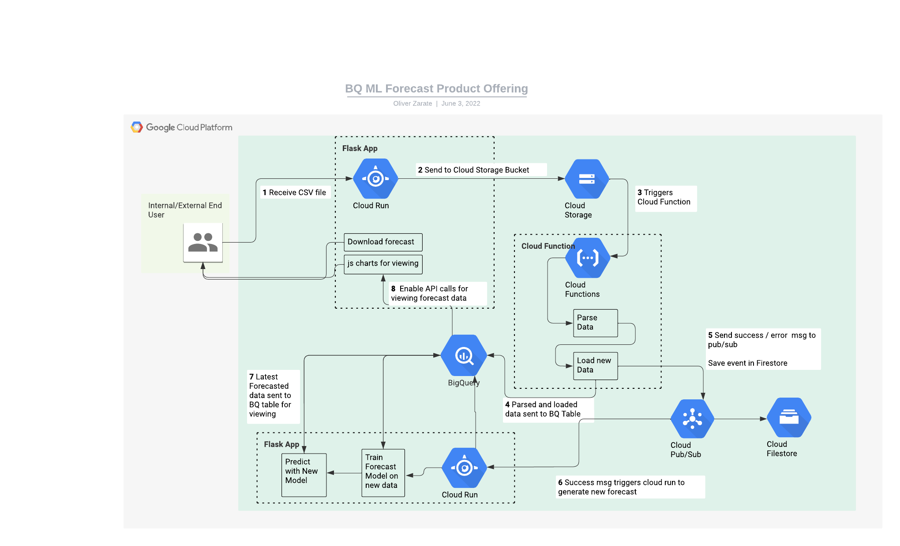

# big_query_ml_forecast

A full implementation using big query and other google cloud services as forecasting solution. 

Allows user to take ingest weekly / daily / monthly data, then generate a new forecast each time.

 
